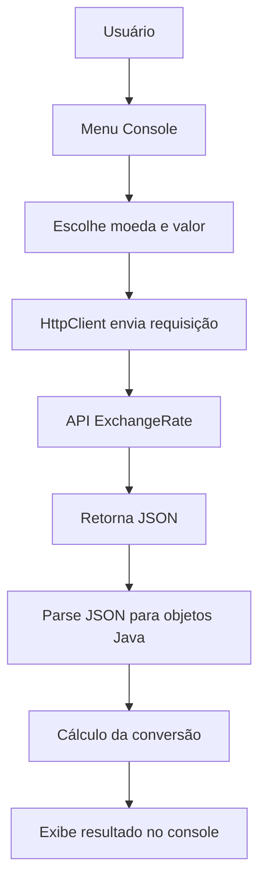

# 💱 Challenge Conversor de Moedas 💱

Projeto simples e funcional para praticar o consumo de **APIs REST** em Java, com leitura de dados JSON e interação via **console**. Desenvolvido como parte do programa de formação em tecnologia da **Alura + Oracle Next Education**.

---

## Funcionalidades

Este conversor permite ao usuário escolher entre diferentes moedas e realizar conversões com base em **valores atualizados em tempo real**, utilizando uma API externa de câmbio.

- Projeto executado totalmente no console
- Menu com 6 opções de conversão
- Conversões baseadas em taxas reais
- Estrutura orientada a objetos com boas práticas

---

## Sobre o Projeto

O projeto utiliza a classe **`HttpClient`** do Java para realizar requisições HTTP à API de câmbio, obtendo dados atualizados de moedas em tempo real.  
As respostas, geralmente em **JSON**, são parseadas para objetos Java, permitindo que o programa acesse facilmente os valores das taxas de câmbio.  

Essa abordagem garante que as conversões sejam precisas e que o usuário tenha uma experiência interativa e confiável no console. Além disso, o uso de **orientação a objetos** torna o código organizado, reutilizável e de fácil manutenção.

---

## Fluxo do Conversor de Moedas (Mermaid)

## API ExchangeRate
Os dados são obtidos da API gratuita:

🔗 ExchangeRate API

Para usar, é necessário gerar uma chave de API gratuita no site.

## Como Executar o Projeto
1. Clone este repositório:

- git clone https://github.com/seu-usuario/seu-repositorio.git

2. Importe o projeto no IntelliJ IDEA (ou sua IDE preferida)
3. Configure a variável de ambiente com sua chave da API:
- API_KEY=suachaveaqui
4. Execute a classe Principal.java para iniciar

## Créditos
Este projeto foi proposto como desafio pelo programa:
- Oracle Next Education
- Alura - Cursos de tecnologia

## Licença
Projeto de uso educacional, livre para estudos e modificações.

Desenvolvido com ☕ por Iasmin Oliveira
